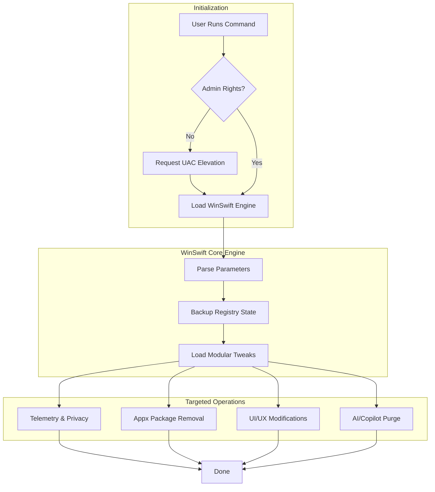
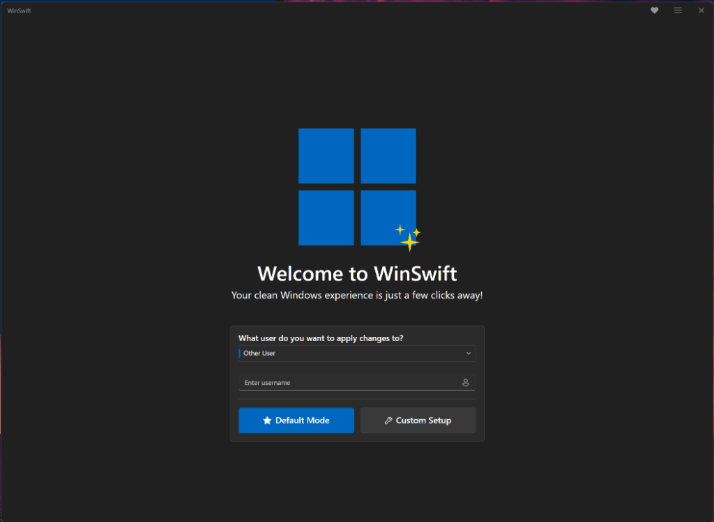
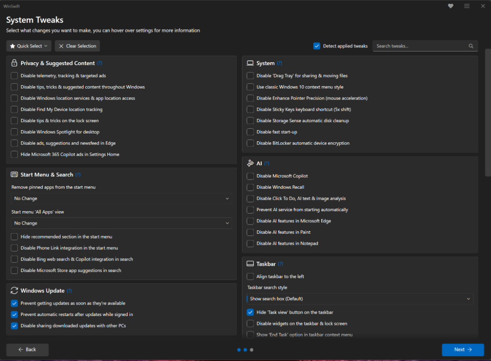
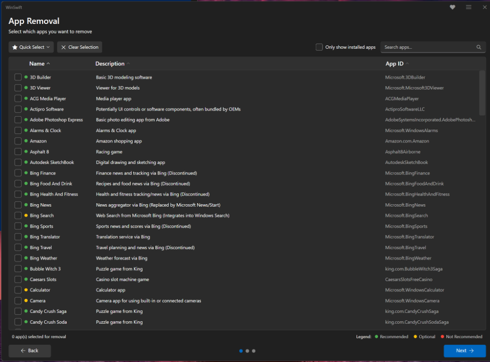
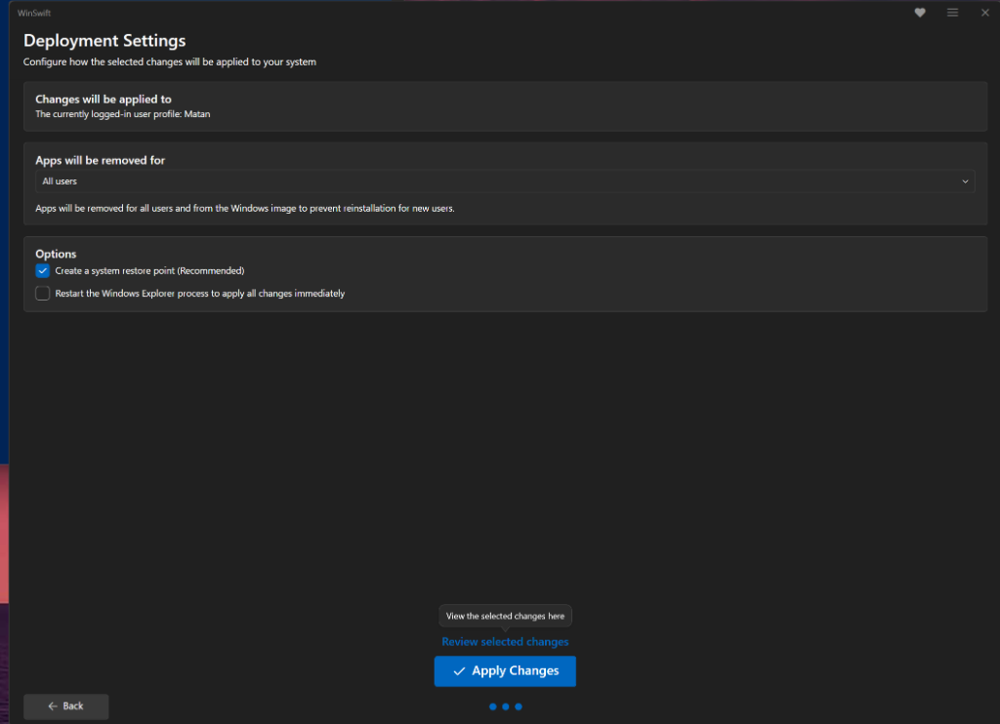

<p align="center">
  
</p>

<p align="center">
  
  
  
  
</p>

> **Notice:** WinSwift is an enterprise-grade, rebranded fork of the open-source project [Raphire/Win11Debloat](https://github.com/Raphire/Win11Debloat). All original credits and core architecture concepts belong to the Raphire team. We have implemented our own unified build system and UI adjustments to suit strict organizational needs.

WinSwift is a lightweight, easy-to-use PowerShell script that allows you to quickly declutter and customize your Windows experience—**no installation required!** Remove pre-installed apps, disable telemetry, strip out intrusive interface elements, and reclaim your operating system.

## 🏗️ Architecture & Execution Flow

WinSwift uses a robust PowerShell execution engine with strict error handling and UAC elevation to apply modifications safely.


```mermaid
graph TD
    subgraph Execution["Initialization"]
        A[User Runs Command] --> B{Admin Rights?}
        B -- No --> C[Request UAC Elevation]
        C --> D
        B -- Yes --> D[Load WinSwift Engine]
    end

    subgraph CoreEngine["WinSwift Core Engine"]
        D --> E[Parse Parameters]
        E --> F[Backup Registry State]
        F --> G[Load Modular Tweaks]
    end

    subgraph Operations["Targeted Operations"]
        G --> H[Telemetry & Privacy]
        G --> I[Appx Package Removal]
        G --> J[UI/UX Modifications]
        G --> K[AI/Copilot Purge]
    end

    H --> L[Done]
    I --> L
    J --> L
    K --> L
```

## ✨ What's New in v3.1.0

We've overhauled WinSwift to keep up with the latest Windows 11 updates (24H2 and 25H2), focusing heavily on protecting your privacy from new AI integrations and telemetry.

- **The Ultimate AI Purge:** We now actively hunt down and disable Copilot, Windows Recall, Click to Do, and generative AI features embedded in Paint, Notepad, and Photos. 
- **Ironclad Privacy:** We've introduced a dual-layer telemetry block. WinSwift now disables tracking services at their root and applies hardcoded Firewall and HOSTS rules to prevent Windows from phoning home.
- **Unattend Generator:** Building a new PC? Use our built-in XML generator to create a Windows installation file that entirely skips the Microsoft Account requirement and OOBE tracking screens.
- **Ad-Free Experience:** We've expanded our ad-blocker to target the newest promotional banners Microsoft injected into the Settings app and File Explorer.

<p align="center">
  
  
</p>
<p align="center">
  
  
</p>

## 🚀 Usage

> [!WARNING]
> Great care went into making sure this script does not unintentionally break any OS functionality, but **use at your own risk!** If you run into any issues, please report them [on our Issue Tracker](https://github.com/BiosSystem/WinSwift/issues).

### Quick Method (Recommended)

Run the script directly from our raw GitHub repository using PowerShell.

1. Open PowerShell or Terminal.
2. Copy and paste the command below into PowerShell:

```PowerShell
$f = New-TemporaryFile | Rename-Item -NewName { $_.Name + '.ps1' } -PassThru
irm https://raw.githubusercontent.com/BiosSystem/WinSwift/master/WinSwift.ps1 -OutFile $f
& $f
Remove-Item $f -Force
```
*(Alternatively, you can download the script and run it manually)*

3. Wait for the script to automatically download and launch WinSwift.
4. Carefully read through and follow the on-screen instructions.

This method supports command-line parameters to customize the behaviour of the script. Please refer to our [Wiki](https://github.com/BiosSystem/WinSwift/wiki) for advanced parameters.

### Traditional Method

<details>
  <summary>Click here for manual download instructions</summary><br/>

  1. [Download the latest version](https://github.com/BiosSystem/WinSwift/releases/latest) and extract the `.ZIP` file to your desired location.
  2. Navigate to the WinSwift folder.
  3. Double click the `Run.bat` file to start the script. 
  4. Accept the Windows UAC prompt to run the script as administrator.
  5. Carefully read through and follow the on-screen instructions.
</details>

### Advanced Method (PowerShell Direct)

<details>
  <summary>Click here for advanced PowerShell execution</summary><br/>

  1. [Download the latest version](https://github.com/BiosSystem/WinSwift/releases/latest) and extract the `.ZIP` file.
  2. Open PowerShell as an administrator.
  3. Temporarily enable PowerShell execution by entering the following command:

  ```PowerShell
  Set-ExecutionPolicy Unrestricted -Scope Process -Force
  ```

  4. Navigate to the directory where the files were extracted: `cd C:\WinSwift`
  5. Run the script:

  ```PowerShell
  .\WinSwift.ps1
  ```
</details>

## 📚 Developer Wiki & Technical Deep-Dive

Are you a developer, sysadmin, or power user? We have created a comprehensive, open-source technical Wiki detailing the exact registry keys, services, and execution flows used by WinSwift.

👉 **[Read the Developer Wiki & Documentation Here](docs/Home.md)**

## 🛠️ Feature Overview

> [!TIP]
> All changes made by WinSwift can easily be reverted, and almost all removed apps can be reinstalled through the Microsoft Store. Visit our [Wiki](https://github.com/BiosSystem/WinSwift/wiki/Reverting-Changes) for reversion instructions.

### 🗑️ App Removal & Bloatware
Clean up your Start menu by instantly removing pre-installed bloatware (like TikTok, Candy Crush, and OEM manufacturer apps) in a single click.

### 🕵️ Privacy & Telemetry Hardening
Take back control of your data. We disable background diagnostic data collection, activity history, targeted advertising IDs, and app-launch tracking. Your PC should serve you, not advertisers.

### 🤖 The AI Purge
Not a fan of Microsoft's new AI push? WinSwift completely neutralizes Windows Recall snapshots, Copilot integrations, and AI-driven suggestions across Edge, Paint, and the OS workspace.

### 🎮 Gaming & Performance Modes
Squeeze every drop of performance out of your hardware:
- **Gaming Mode:** Automatically switches your PC to High Performance, lowers network latency for multiplayer games, disables mouse acceleration, and prevents background maintenance tasks from interrupting your match.
- **Competitive Esports Mode:** For the hardcore players. Unlocks the hidden Ultimate Performance power plan, forces ultra-low system timer resolutions (0.5ms), and fine-tunes CPU/GPU scheduling to eliminate micro-stutters.
- **Defender Exclusions:** Automatically tells Windows Defender to ignore your Steam, Epic, and GOG libraries, stopping real-time antivirus scans from slowing down game loading screens.

### 🚫 System-Wide Ad Blocker
Microsoft has started putting ads inside the operating system itself. We turn them all off. Say goodbye to Lock Screen promotional banners, Start Menu suggested apps, and Settings app "tips".

### ⚡ General Performance Tweaks
We turn off unnecessary background services that eat up your RAM and slow down your hard drive, such as Windows Search indexing and Superfetch, making your desktop feel much snappier.

### 🛡️ Security Hardening
Close dangerous loopholes that malware loves to exploit. We disable outdated protocols (like SMBv1 and TLS 1.0) and block common attack vectors like AutoRun and Windows Script Host.

### 📦 Automated Software Installer
Setting up a new PC? Check a few boxes and let WinSwift automatically download and install your favorite essential apps (like 7-Zip, Brave, VLC, and Discord) without you having to click through a single installer wizard.

### 🔎 Dry-Run & Run Summaries
Curious about what WinSwift actually does under the hood? Turn on Dry-Run Mode to safely preview all the changes without actually applying them. When you do run it for real, you'll get a clean summary report of exactly what was modified.

## 🤝 Contributing

We welcome contributions of all kinds! Please see our [Contributing Guidelines](https://github.com/BiosSystem/WinSwift/blob/master/.github/CONTRIBUTING.md) for detailed instructions on how to get started.

## 📄 License

WinSwift is licensed under the MIT license. See the `LICENSE` file for more information.
