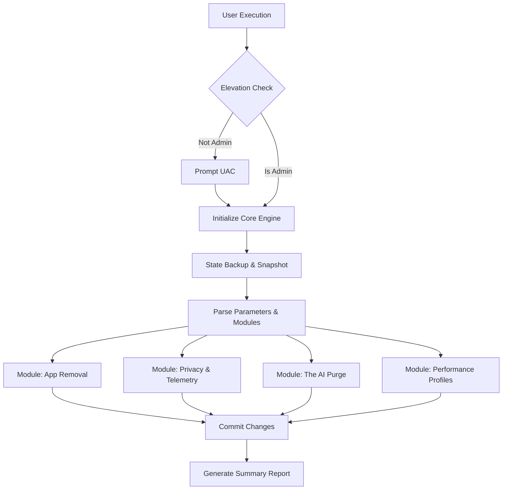

<p align="center">
  
</p>

<p align="center">
  
  
  
  
</p>

> **Notice:** WinSwift is an enterprise-grade, rebranded fork of the open-source project [Raphire/Win11Debloat](https://github.com/Raphire/Win11Debloat). All original credits and core architecture concepts belong to the Raphire team.

---

## 🚀 The Ultimate Windows Optimization Engine

WinSwift is a lightweight, highly modular PowerShell engine engineered to instantly declutter, customize, and harden Windows 11 without requiring any installation or permanent background services. 

Whether you are provisioning enterprise workstations, configuring a dedicated competitive gaming rig, or simply reclaiming your privacy from invasive telemetry, WinSwift executes rapid, surgical strikes on OS bloatware.

---

## ⚙️ How It Works

WinSwift operates entirely in memory using standard PowerShell protocols. It takes a backup snapshot of your state, parses your configuration, and surgically removes or alters OS components.


```mermaid
flowchart TD
    A[User Execution] --> B{Elevation Check}
    B -- Not Admin --> C[Prompt UAC]
    C --> D
    B -- Is Admin --> D[Initialize Core Engine]
    
    D --> E[State Backup & Snapshot]
    E --> F[Parse Parameters & Modules]
    
    F --> G[Module: App Removal]
    F --> H[Module: Privacy & Telemetry]
    F --> I[Module: The AI Purge]
    F --> J[Module: Performance Profiles]
    
    G & H & I & J --> K[Commit Changes]
    K --> L[Generate Summary Report]
```

---

## ✨ Core Capabilities

WinSwift is divided into powerful, self-contained modules that target specific operational areas of the Windows environment. 

### 1. Privacy & Telemetry Hardening
Regain control over your data. WinSwift cuts off diagnostics, tracking, and advertising pipelines at the root.

| Feature | Description | Impact Level |
|---------|-------------|--------------|
| **Diagnostic Data** | Disables Windows diagnostic data collection and activity history. | High |
| **Telemetry Endpoints** | Applies hardcoded firewall and HOSTS file rules to block telemetry servers. | High |
| **Advertising IDs** | Turns off targeted advertising IDs and system-wide ad tracking. | Medium |
| **Ad Blocker** | Disables Start Menu suggested apps, Settings banners, and Lock Screen ads. | Medium |

### 2. App Removal & Bloatware Cleanup
Strip the operating system down to its bare essentials for maximum efficiency.

| Feature | Description | Impact Level |
|---------|-------------|--------------|
| **OEM Bloatware** | Removes manufacturer-installed junkware and trial software. | High |
| **Consumer Apps** | Uninstalls TikTok, Candy Crush, and other consumer pre-installs. | Medium |
| **Start Menu Cleanup** | Unpins dead tiles and promotional shortcuts. | Low |
| **System Apps** | Safely removes unused built-in Windows applications via `Remove-AppxPackage`. | Medium |

### 3. The AI Purge (24H2 / 25H2)
For environments where embedded Generative AI is a liability or unwanted distraction.

| Feature | Description | Impact Level |
|---------|-------------|--------------|
| **Windows Copilot** | Neutralizes Copilot integrations system-wide, including the taskbar icon. | High |
| **Windows Recall** | Disables Windows Recall snapshots and related background services. | High |
| **Click to Do** | Turns off contextual AI actions across the OS. | Medium |
| **Embedded AI** | Disables generative AI features in Paint, Notepad, and Photos. | Low |

### 4. Performance Modes
Unlock the full potential of your hardware with specialized tuning profiles.

| Mode | Target Audience | Key Adjustments |
|------|-----------------|-----------------|
| **Gaming Mode** | Gamers, Power Users | High Performance power plan, network latency optimization, disabled mouse acceleration. |
| **Esports Mode** | Competitive Gamers | Ultimate Performance plan, 0.5ms system timer resolution, CPU/GPU scheduling prioritization. |
| **Defender Tweaks** | All Gamers | Whitelists game libraries (Steam, Epic, GOG) to prevent real-time scan overhead during gameplay. |

---

## 📖 Technical Documentation

For an in-depth look at our architecture, registry modifications, deployment methods, and security practices, please consult our comprehensive technical wiki.

> 👉 **[Read the WinSwift Technical Wiki](docs/WIKI.md)**

---

## ⚡ Quick Start

Run WinSwift directly from PowerShell without downloading any files manually. This method is perfect for rapid deployment on fresh installations.

```PowerShell
$f = New-TemporaryFile | Rename-Item -NewName { $_.Name + '.ps1' } -PassThru
irm https://raw.githubusercontent.com/BiosSystem/WinSwift/master/WinSwift.ps1 -OutFile $f
& $f
Remove-Item $f -Force
```

> [!WARNING]
> While designed to be safe and reversible, modifying OS features carries inherent risks. Use at your own risk. Check out the [Wiki](docs/WIKI.md) for instructions on how to revert changes.

---

## 🤝 Contributing & License

We welcome contributions from the community! Please see our [Contributing Guidelines](.github/CONTRIBUTING.md) before submitting a pull request.

WinSwift is released under the MIT license.
